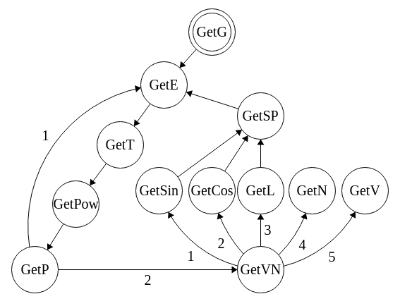
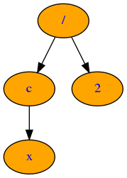
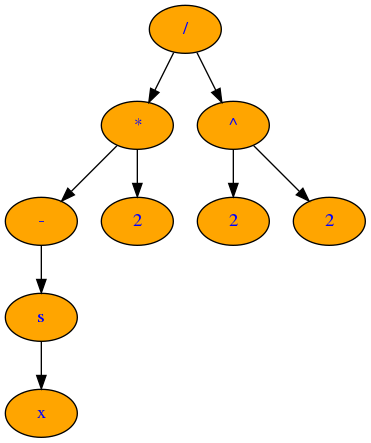

# Differentiation
## Main functions
+ You can analyze syntax of expression (expression correctness)
+ You can calculate value of the expression.
+ You can differentiate the expression.
+ You can visualize an expression as a tree graph
+ You can visualize an expression as pdf
+ Tree optimizator has been created too.

#### Also:
+ You can save your tree (=expression) with special code to file
+ You can refresh your expression from this file
+ You can create .dot file of your tree (this file used to create tree)

## System requirements
+ A command processor must be available to execute the command "system"
+ A package must be installed that includes latex, in particular the "pdflatex" command (for example, texmaker package)
+ A graphwiz package must be installed

## Usage
+ To use the calculator, enter an expression in standard input
+ To get the differentiation result in pdf format, pass the name of the auxiliary file (.tex extension) as the first command-line argument. The name of the resulting file will be the same with him.
+ To see images of tree-expressions (original and differentiated) enter the names of the images by 2,3 command line parameters.

## Main idea
Build tree that illustrates entered expression.  
(left and right childs = parameters of operation, it can be only one left child for unary operations)  
Differentiation is a tree search (from parents to children) and differentiation by the principle of a complex function.  
Visualization is also a pass through the tree, but with a writing of the TeX code.  
But, wait, how do I build a tree, how do I parse an expression?  
#### The algorithm of expression parsing
You can see analyzing (parsing) graph below.  
  
```cpp
    Node* GetG();   // Get full expression
    Node* GetN();   // Get number
    Node* GetE();   // Get addition or subtraction
    Node* GetT();   // Get multiplication ot division
    Node* GetP();   // Get parenthesis
    Node* GetV();   // Get variable
    Node* GetVN();  // Get variable, number, variable + number, sin, cos, ln
    Node* GetSin(); // Get sin
    Node* GetCos(); // Get cos
```
These functions try to "get" the corresponding operation or their repetition (that is, they can only read this operation), and use the next arrow function in the graph as an argument(s).  
When the function can't parse the expression any further, it leaves the string unchanged, and the tree received at this stage passes it in the opposite direction of the arrow (recursion).  
If, for example, the GetVN function has more than one outgoing arrow, it uses all the children in turn.  
However, from the point of view of expression analysis, the children of this function are equal and only one of them can parse expressions at this stage (or no one).
## Examples  
In the pictures below you can see examples of the expression and its differentiated variant.  

  
But if the expression is more complex, the graph visualization is not beautiful.  
So, below you can see an example of differentiating the expression and rendering the response as a pdf.  
  
For implementation details, see the source code!)  
  
AK, 2020
